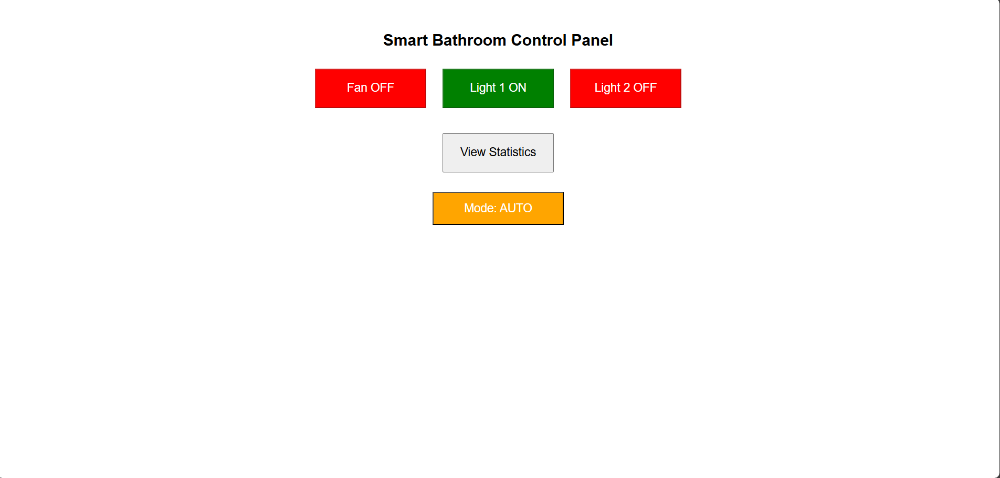
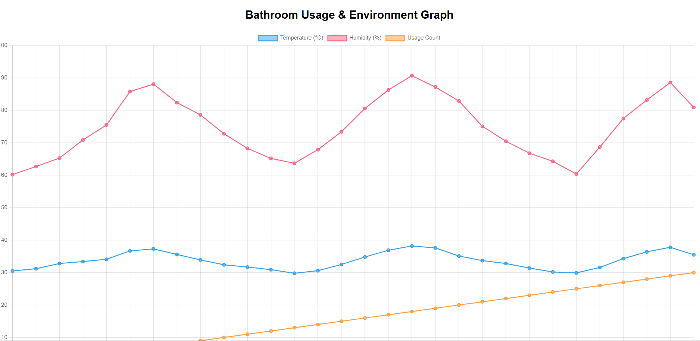

# 🚿 Bathroom IoT Monitoring System

เกมแยกขยะเพื่อการเรียนรู้ พัฒนาโดยใช้ Python และ Pygame
Educational Drag & Drop Recycling Game built with Pygame

---

## 🎮 เกี่ยวกับโปรเจกต์

คือเกมแนว Drag & Drop ที่ผู้เล่นต้องลากขยะไปใส่ถังให้ถูกประเภทภายในเวลาที่กำหนด

เกมนี้ถูกออกแบบเพื่อ:

ส่งเสริมความรู้เรื่องการแยกขยะ

สร้างความตระหนักด้านสิ่งแวดล้อม

ใช้เป็นสื่อการเรียนการสอนในโรงเรียน 

---

## 🏗️ System Architecture

```text
          +-------------+
          |   ESP32     |
          | Temp/Humid  |
          | Distance    |
          +------+------+ 
                 |
                 | HTTP POST (REST API)
                 v
        +------------------+
        |  Node.js Server  |
        |  Express API     |
        +--------+---------+
                 |
                 | SQL
                 v
          +-------------+
          |   MySQL     |
          | sensor_data |
          +-------------+
                 |
                 | HTTP GET
                 v
        +------------------+
        |  Web Dashboard   |
        |  Chart.js Graph  |
        +------------------+
```

---

## ✨ Features

- 🌡 Real-time Temperature Monitoring  
- 💧 Humidity Monitoring  
- 👣 Automatic Usage Counting  
- 🌀 Fan Control via Web  
- 📊 Interactive Graph Dashboard  
- 🔌 REST API Communication  
- 🗄 MySQL Data Storage  

---

## 📸 Screenshots

### 🟢 Control Page


### 📊 Statistics Graph


---

## 🛠 Tech Stack

| Technology | Purpose |
|------------|----------|
| Node.js | Backend runtime |
| Express.js | REST API |
| MySQL | Database |
| mysql2 | Database driver |
| Chart.js | Graph visualization |
| ESP32 | Sensor device |

---

## 📦 Installation Guide

### 1️⃣ Clone Repository

```bash
git clone https://github.com/dass0123456789/MiniProjectiot.git
cd MiniProjectiot/Api
```

---

### 2️⃣ Install Dependencies

```bash
npm install
```
---

### 3️⃣ Database Setup

#### Create Database

```sql
CREATE DATABASE smart_bathroom;
USE smart_bathroom;
```

#### Create Table

```sql
CREATE TABLE sensor_data (
  id INT AUTO_INCREMENT PRIMARY KEY,
  temperature FLOAT,
  humidity FLOAT,
  distance FLOAT,
  created_at TIMESTAMP DEFAULT CURRENT_TIMESTAMP
);
CREATE TABLE device_state (
  id INT AUTO_INCREMENT PRIMARY KEY,
  fan TINYINT(1) DEFAULT 0,
  light TINYINT(1) DEFAULT 0,
  light2 TINYINT(1) DEFAULT 0,
  mode VARCHAR(20) DEFAULT 'AUTO',
  updated_at TIMESTAMP DEFAULT CURRENT_TIMESTAMP 
             ON UPDATE CURRENT_TIMESTAMP
);
INSERT INTO device_control (fan, light, light2, mode)
VALUES (0, 0, 0, 'AUTO');
```

---

### 4️⃣ Configure Database Connection

Edit `server.js`:

```js
const mysql = require('mysql2');

const db = mysql.createConnection({
  host: 'localhost',
  user: 'root',
  password: 'YOUR_DATABASE_PASSWORD',
  database: 'smart_bathroom'
});
```
---

### 5️⃣ Configure Telegram Bot Connection

Edit `server.js`:

```js
const TelegramBot = require("node-telegram-bot-api")

const bot = new TelegramBot("YOUR_BOT_TOKEN")
const chatId = "YOUR_CHAT_ID"
```

---

### 6️⃣ Configure Arduino (ESP32) IP API Server

Edit `esp32.ino`:

```c
const char* server = "http://YOUR_BACKEND_IP:3000";
```

---

## ▶️ Running the Server

```bash
node server.js
```

or

```bash
npx nodemon server.js
```

Server runs at:

```
http://localhost:3000
```

---

## 🌐 Web Usage

### 🟢 Control Page
```
http://localhost:3000/control.html
```

Features:

- Turn Fan ON/OFF  
- Navigate to Statistics Page  

---

### 📊 Statistics Page
```
http://localhost:3000/stats.html
```

Displays:

- Temperature graph  
- Humidity graph  
- Usage count graph  

---

## 🔌 REST API Documentation

### 📥 1. Insert Sensor Data

**Endpoint**

```
POST /api/sensor
```

**Request Body (JSON)**

| Field | Type | Description |
|-------|------|-------------|
| temp | float | Temperature value |
| humidity | float | Humidity value |
| distance | float | Distance sensor value |

**Example**

```json
{
  "temp": 28.5,
  "humidity": 65.2,
  "distance": 15.0
}
```

---

### 📊 2. Get Statistics Data

**Endpoint**

```
GET /api/stats
```

**Response Format**

```json
{
  "labels": [],
  "temperature": [],
  "humidity": [],
  "usage": []
}
```

---

## 👣 Usage Counting Logic

The system calculates cumulative usage count based on the number of rows recorded in the database over time.

```sql
SELECT COUNT(*) 
FROM sensor_data d2 
WHERE d2.created_at <= d1.created_at
```

---

## 🧪 Testing API with cURL

```bash
curl -X POST http://localhost:3000/api/sensor \
-H "Content-Type: application/json" \
-d "{\"temp\":30,\"humidity\":60,\"distance\":10}"
```

---

## 📁 Project Structure

```text
MiniProjectiot
│
├── Api/
│   ├── public/
│   │   ├── control.html
│   │   └── stats.html
│   ├── server.js
│   └── package.json
│
├── Arduino/esp32/esp32.ino
├── screenshots/
│   ├── control.png
│   └── stats.png
└── README.md
```

---

## 🔒 Security Notes

- Ensure MySQL is running  
- Open port 3000 if using external ESP32  
- Configure correct local IP address for ESP32 HTTP request  

---

## 📈 Future Improvements

- Add Authentication (Login System)  
- Real-time update with WebSocket  
- Deploy to Cloud (Render / Railway / AWS)  
- Add Threshold Alerts  
- Mobile-friendly dashboard  

---

## 👨‍💻 Author

Mini Project – IoT Smart Bathroom System  
Developed for academic project submission 🚀
